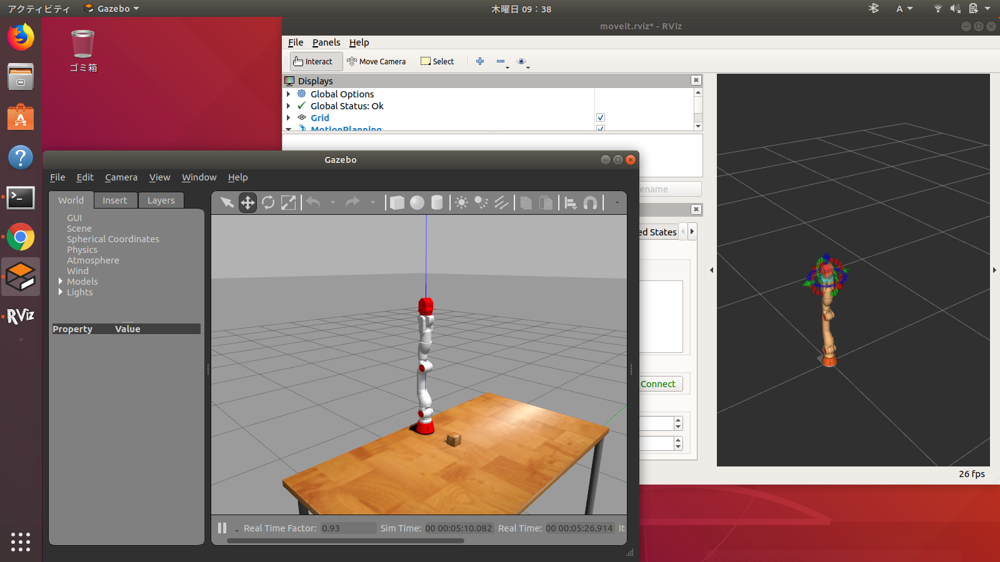

# 設計製作論実習3

## 第2回

千葉工業大学 上田 隆一

<br />

<p style="font-size:50%">
This work is licensed under a <a rel="license" href="http://creativecommons.org/licenses/by-sa/4.0/">Creative Commons Attribution-ShareAlike 4.0 International License</a>.
<a rel="license" href="http://creativecommons.org/licenses/by-sa/4.0/">
</a>
</p>

---

## <span style="text-transform:none">MoveIt!</span>を使う

* [マニピュレータの制御とMoveIt!の利用](https://gbiggs.github.io/ros_moveit_rsj_tutorial/manipulators_and_moveit.html)

---

### 題材

* CRANE-X7のROSパッケージ
    * まずは[README](https://github.com/rt-net/crane_x7_ros/blob/master/README.md)をよく読む
        * 実機についての言及がありますが、まだ実機は扱いません
        * Gazeboのシミュレーションのところをよく読みましょう

---


### 起動

```
$ roslaunch crane_x7_gazebo crane_x7_with_table.launch
```



* 左下: Gazebo
    * シミュレータ
* 右上: RViz 
    * ROSのモニタリング/コントロールツール

