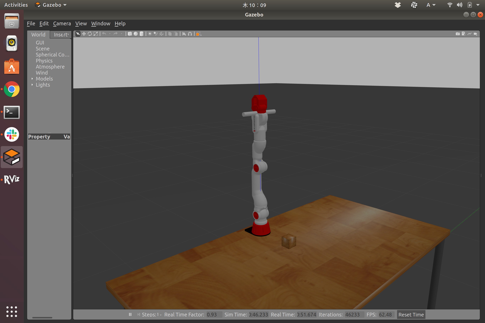

# 設計製作論実習3

## 第4回

千葉工業大学 上田 隆一

<br />

<p style="font-size:50%">
This work is licensed under a <a rel="license" href="http://creativecommons.org/licenses/by-sa/4.0/">Creative Commons Attribution-ShareAlike 4.0 International License</a>.
<a rel="license" href="http://creativecommons.org/licenses/by-sa/4.0/">
</a>
</p>

---

### カメラを扱う

* シミュレータ（Gazebo）
* 実機

---

### Gazebo環境内でのカメラの利用

---

### カメラスタンドの取り付け（1/4）

* 手順
    * `crane_x7_ros/crane_x7_description/urdf/crane_x7.xacro`ファイルに次のように1行追加
        * urdfファイル: ロボットのリンクや関節を記述したファイル 
        * xacroファイル: urdfファイルを簡潔に書いたもの

```
<?xml version="1.0"?>
<robot xmlns:xacro="http://ros.org/wiki/xacro">
・・・
  <xacro:include filename="$(find crane_x7_description)/urdf/crane_x7_wide_two_finger_gripper.xacro"/>
  <!--追加！！！-->
  <xacro:include filename="$(find crane_x7_description)/urdf/camera.urdf"/>
・・・
```

---

### カメラスタンドの取り付け（2/4）

* `~/catkin_ws/src/crane_x7_ros/crane_x7_description/urdf/camera.urdf`の記述
    * XMLで以下を記述
        * リンク（棒）を一本
        * ロボットとリンクを取り付ける固定関節を一個

```
<?xml version="1.0"?>

<robot name="camera">
  <link name="camera_stand_link">
      リンクに関する記述（次ページ）
  </link>

  <joint name="camera_stand_joint" type="fixed">
      関節に関する記述（次々ページ）
  </joint>

</robot>
```

---

### カメラスタンドの取り付け（3/4）

* リンクの記述
    * inertia: 慣性モーメント（この例では適当に軽く設定してある）
    * visual: 見かけの姿（20cm、半径1cmの丸棒）

```
<link name="camera_stand_link">
  <inertial>
    <mass value="1e-6"/>
    <origin xyz="0 0 0" rpy="0 0 0"/>
    <inertia ixx="1.0" ixy="0.0" ixz="0.0" iyy="1.0" iyz="0.0" izz="1.0"/>
  </inertial>
  <visual>
    <geometry>
      <cylinder length="0.20" radius="0.01"/>
    </geometry>
    <material name="white">
      <color rgba="0 0 0 1" />
    </material>
  </visual>
</link>
```

---

### カメラスタンドの取り付け（4/4）

* 関節の記述
    * `parent, child`に関節の両側のリンクを指定
    * `origin`が関節の位置（`parent`基準）
        * `rpy`はロール・ピッチ・ヨー

```
<joint name="camera_stand_joint" type="fixed">
  <parent link="crane_x7_gripper_base_link"/>
  <child  link="camera_stand_link"/>
  <origin xyz="0 0 0" rpy="1.570796326795 1.570796326795 0"/>
</joint>

```

---

### カメラスタンドの取り付け（4/4）

* Gazeboを立ち上げるとハンドの根本に棒が付く




$ sudo apt install ros-melodic-moveit-setup-assistant

